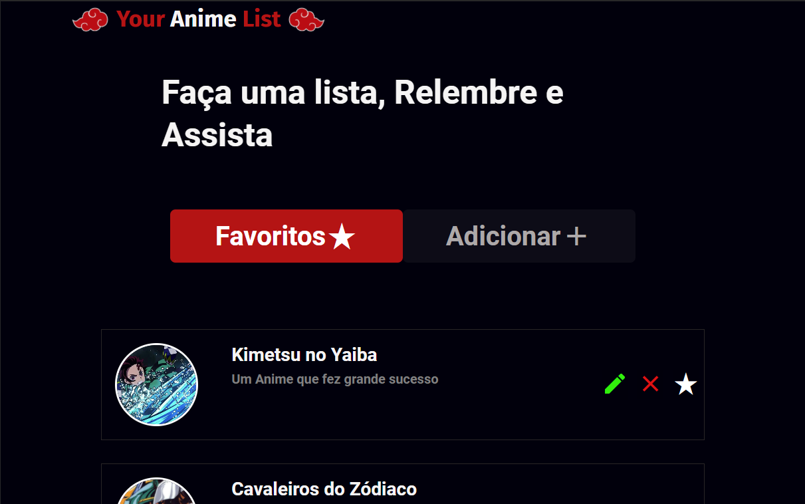
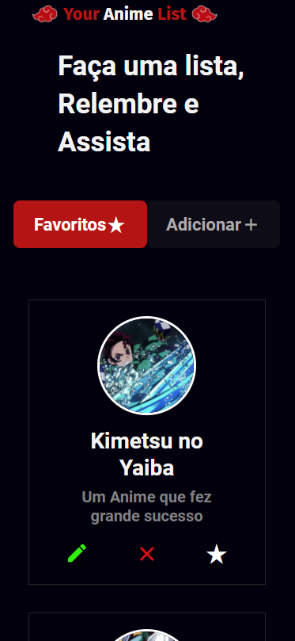
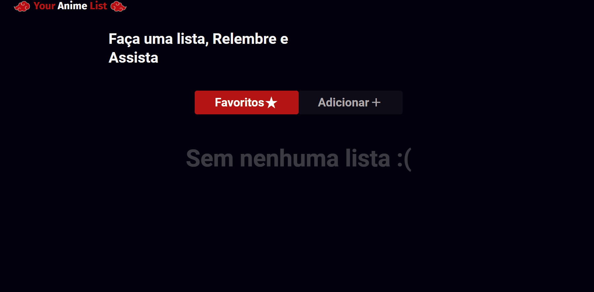
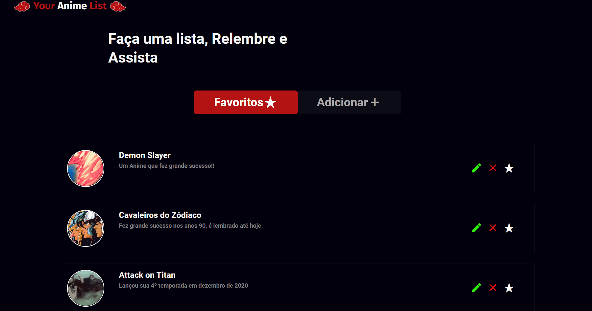
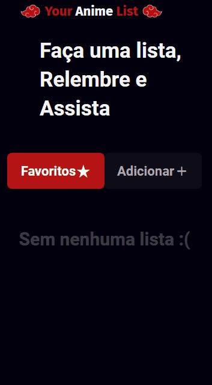
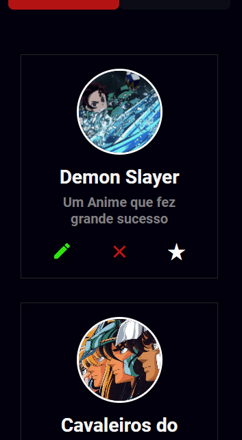

# 🎈 YourAnimeList 🎈

## Desktop 💻



## Mobile 📱



<hr>

# Descrição 📝

Projeto de Listas, ele é um CRUD então o usuário possui a liberdade de criar, ler, editar e deletar, essa é a primeira versão do **_"YourAnimeList V 1.0"_**
Pretendo adicionar:

- Autenticação do Usuário
- Compartilhamento da Lista de Favoritos

<hr>

## Projeto Desktop 💻

### Função Adicionar ➕



### Função Editar 🖊️


### Função Favorito ⭐


### Função Excluir ❌



## Projeto Mobile 📱

### Função Adicionar ➕



### Função Editar 🖊️



### Função Favorito ⭐


### Função Excluir ❌


# Tecnologias 🚀

**_Obs: para o projeto rodar é necessário possuir:_**

- Visual Studio Code
- Node.js
- yarn
- Git

**Front-end**

- ejs: **Template Engine**
- javascript

**Back-end**

- node.js
- express
- moongose
- mongoDB: **Banco de Dados**

# Como Iniciar o Projeto 👨🏻‍💻

```
# Para clonar o repositório:
$ git clone https://github.com/vidarafael/YourAnimeList.git

# Acesse a pasta do projeto no terminal
$ cd YourAnimeList

# Abrindo o Projeto no Visual Studio
$ code .

# Instale as dependências com npm
$ yarn install

# Execute a aplicação
$ node app

# Após isso o servidor iniciará na porta: 3333
# acesse http://localhost:3333
```
